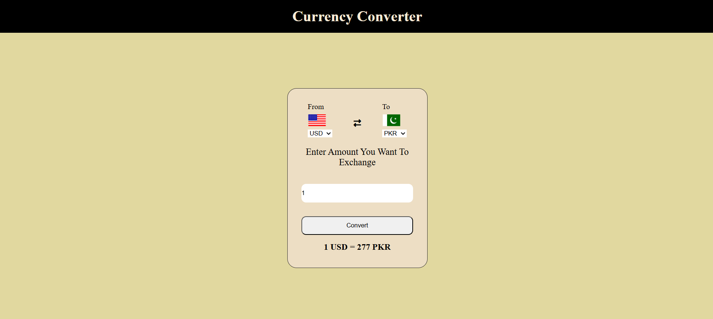

# 💱 Currency Converter

A simple and responsive **Currency Converter** web application built using **HTML, CSS, and JavaScript**. This project allows users to convert one currency into another using real-time exchange rates from an API.

## 🚀 About the Project

This is my **first JavaScript project**, created while learning JavaScript and web development. The main goal of this project was to understand how to:

- Work with JavaScript functions and events
- Fetch data from an API using `fetch()`
- Handle JSON responses
- Update the DOM dynamically
- Build a real-world web application

## ✨ Features

- 🌍 Convert between different world currencies
- 🔄 Real-time exchange rates
- 🚩 Country flags for selected currencies
- 📱 Responsive and user-friendly interface
- ⚡ Fast and simple conversion process

## 🛠️ Technologies Used

- HTML5
- CSS3
- JavaScript (ES6)
- Exchange Rate API

## 📚 What I Learned

While building this project, I learned:

- JavaScript fundamentals
- DOM Manipulation
- Fetch API
- Working with asynchronous JavaScript
- Handling API responses
- Creating interactive web applications

## 🎯 Future Improvements

- Add conversion history
- Dark mode
- Favorite currencies
- Offline support
- Better UI animations

## 📸 Preview

## 🤝 Contributing

Suggestions and improvements are always welcome. Feel free to fork this repository and create a pull request.

## ⭐ Support

If you like this project, don't forget to **star** this repository. It motivates me to build more amazing projects as I continue my web development journey.

---

**Made with ❤️ while learning JavaScript.**
